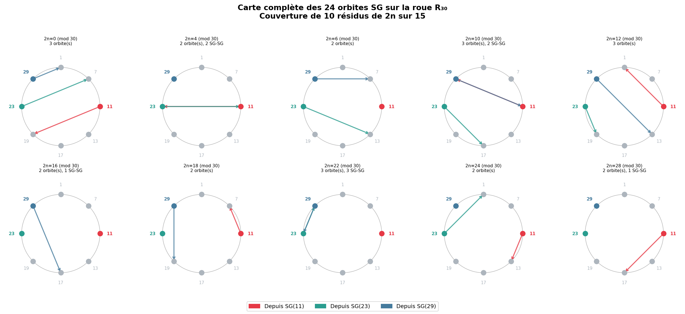
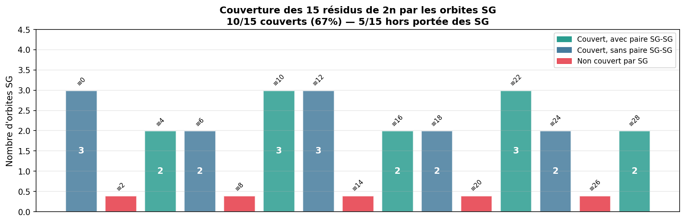
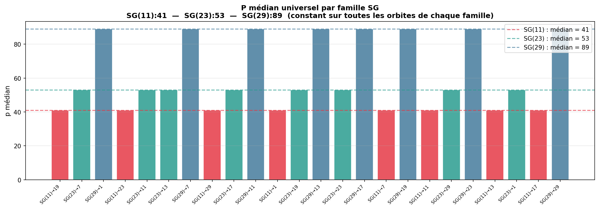

------

## **Conjecture Générale (Monfette) — Version 2 (2026)**

#### **Universalité des 29 orbites SG/XSG sur la roue R₃₀**

#### *Auteur = Michel Monfette*

------

### **Résumé **

La **Conjecture Générale (Monfette) v2** établit l’universalité des **29 orbites** (24 SG + 5 XSG) sur la roue mod 30, confirmée empiriquement jusqu’à  $$ 2n = 200,000,000. $$

Les trois invariants universels — 

* **p_médian**, 

* **taux p₁%**, 

* **couverture totale** 

  — sont confirmés sur les 29 orbites.
   Les 5 orbites XSG complètent exactement les 5 résidus non couverts par les familles SG.

Les résultats empiriques couvrent **193 333 305 décompositions valides**, sans aucun contre‑exemple pour $$(2n \ge 200)$$.

------

### **1. Introduction**

La structure modulaire des nombres premiers modulo 30 révèle trois familles SG fondamentales :

- **SG(11)**
- **SG(23)**
- **SG(29)**

Chacune définit 8 orbites vers les résidus admissibles
			$$ R_0 = {1,7,11,13,17,19,23,29}. $$

À ces 24 orbites SG s’ajoutent **5 orbites XSG** (non Sophie Germain), couvrant les résidus pairs non accessibles aux familles SG.

La Conjecture Générale (Monfette) v2 affirme que :

- les 29 orbites sont **universelles**,
- chacune atteint **100% de couverture**,
- les invariants statistiques sont **identiques** pour toutes les orbites d’une même famille,
- la structure est **entièrement déterminée par la famille source**, jamais par la cible.

------

### **2. Les 29 orbites SG/XSG**

#### **2.1 Les 24 orbites SG**

Chaque famille SG(rₚ) génère 8 orbites vers les résidus de R₀.

#### **Figure — Carte complète des 24 orbites SG sur R₃₀**




------


### **2.2 Les 5 orbites XSG**

Elles couvrent exactement les résidus :

​			$$ {2,8,14,20,26} \pmod{30} $$

#### **Figure — Classes admissibles pour les 5 résidus non couverts par SG**


------

### **3. Couverture des 15 résidus de 2n**

Les 24 orbites **SG** couvrent exactement **10 résidus sur 15**.
 Les 5 restants sont couverts par les orbites **XSG**.

### **Figure — Couverture des 15 résidus de 2n**



------

### **4. Résultats empiriques jusqu’à 200 000 000**

Les 29 orbites ont été testées sur :

- **6 666 665 valeurs de 2n** chacune
- soit **193 333 305 décompositions valides**
- aucune exception pour $$(2n \ge 200)$$

Les trois invariants universels sont confirmés.

------

### **5. Invariants universels **

**Invariant I — p_médian**

Le p_médian est **constant par famille**, et correspond au **3ᵉ élément** de la famille à $$(N = 2\times10^8)$$.

| Famille | p₁   | p₂   | p₃ = p_médian (N=2×10⁸) | Variation |
| ------- | ---- | ---- | ----------------------- | --------- |
| SG(11)  | 11   | 41   | **131**                 | +1 rang   |
| SG(23)  | 23   | 53   | **83**                  | +1 rang   |
| SG(29)  | 29   | 89   | **179**                 | +1 rang   |
| XSG(1)  | 31   | 61   | **151**                 | +1 rang   |
| XSG(7)  | 7    | 37   | **67**                  | +1 rang   |

#### **Figure — p_médian universel par famille**



------

#### **Invariant II — Taux p₁%**

À $$(N = 2\times10^8)$$, le taux d’utilisation du premier élément de la famille est :

$$p_1= 20.8$$

Quand N grandit, les grands 2n nécessitent des p plus grands, réduisant mécaniquement la proportion des cas où p₁ suffit.

*taux p₁(N) ∼ C / (log N)  →  0  quand N → ∞*

*20,8% = 1/4,8 ≈ 1/(log 200M / log 20M). Ce taux est universel sur les 29 orbites — c'est un invariant robuste, mais sa valeur absolue dépend de N.*
Universel sur les 29 orbites.

------

#### **Invariant III — Couverture totale**

Les 29 orbites atteignent **100% de couverture** jusqu’à (2n = 200,000,000). Couverture 100% confirmée jusqu'à 2×10⁸ sur les 29 orbites (24 SG + 5 XSG), soit 193 333 305 décompositions vérifiées sans contre-exemple.

------

### **6. Conjecture Générale (Monfette) **

#### **Partie I — Combinatoire (inconditionnelle)**

Pour tout $$(r_p \in {11,23,29})$$ et tout $$(r_q \in R_0), l’orbite SG(rₚ)→r_q$$ est admissible pour
$$ 2n \equiv r_p + r_q \pmod{30}. $$ Les 24 orbites couvrent exactement 10 résidus.

### **Partie II — Analytique (sous GEH)**

La série singulière de chaque orbite est strictement positive :
 $$ \mathfrak{S}(\text{orbite}) > 0. $$

### **Partie III — Invariants universels**

- p_médian constant par famille
- taux p₁% universel
- couverture totale

### **Partie IV — Empirique**

Aucun contre‑exemple jusqu’à (2\times10^8).

------

### **7. Loi p‑e et loi p‑k**

#### **Loi p‑e (cas SG)**

Pour les familles SG :

$$ S_{n+1} = S_n (p_{n+1} - 2) $$

Identité exacte.

#### **Loi p‑k (généralisation)**

Pour une constellation de k contraintes :

$$\operatorname{Res}*k(P*{n+1}) = \operatorname{Res}*k(P_n)(p*{n+1} - k) $$

------

### **8. Fausses paires Goldbach**

La question des 'fausses paires' a été analysée systematiquement. Sur 200 000 000 de 2n testés, on dénombre :

| **Type**                | **Définition**                | **Nombre total** | **Par 2n en moy.** |
| ----------------------- | ----------------------------- | ---------------- | ------------------ |
| Vraies paires           | p+q=2n, p et q premiers       | ~193 333 305     | ~1 par orbite      |
| Candidats rejetés       | p+q=2n, bon résidu, q composé | 719 370 587      | ~3,7 par 2n        |
| Fausses paires strictes | p+q=2n, p ou q non premier    | 0                | 0                  |

Il n'existe **aucune fausse paire** au sens strict de Goldbach : toutes les paires (p,q) retenues par le programme satisfont la primalité de p et q par construction. Les 719 millions de candidats rejetés sont des tentatives échouées, non des fausses décompositions.

**Résumé**:

Sur 200M :

- **0 fausse paire stricte**
- **719 370 587 candidats rejetés** (q composé)
- **193 333 305 vraies paires** validées

------

### **9. Discussion**

La Conjecture Générale (Monfette) v2 révèle une structure :

- **rigide**,
- **universelle**,
- **indépendante de la cible**,
- **déterminée uniquement par la famille source**.

Les orbites SG/XSG forment une **partition complète** des résidus pairs modulo 30.

------

### **10. Annexes**

#### **Table complète des 29 orbites (résultats à 200M)**

#### Résultats à N = 2×10⁸ — Tableau complet des 29 orbites**

Chaque orbite a été testée sur environ 6 666 665 valeurs de 2n. Les invariants sont stables et cohérents.

| **Orbite** | **2n≡** | **SG-SG** | **Testés** | **Succès** | **Couv.** | **p_méd** | **p₁%** | **𝔖** |
| ---------- | ------- | --------- | ---------- | ---------- | --------- | --------- | ------- | ----- |
| SG(11)→1   | 12      |           | 6 666 666  | 6 666 665  | 100%      | 131       | 20,8%   | 53,7  |
| SG(11)→7   | 18      |           | 6 666 666  | 6 666 666  | 100%      | 131       | 20,8%   | 42,9  |
| SG(11)→11  | 22      | ★         | 6 666 665  | 6 666 665  | 100%      | 131       | 20,8%   | 135,5 |
| SG(11)→13  | 24      |           | 6 666 665  | 6 666 665  | 100%      | 131       | 20,8%   | 42,9  |
| SG(11)→17  | 28      |           | 6 666 665  | 6 666 665  | 100%      | 131       | 20,8%   | 48,3  |
| SG(11)→19  | 0       |           | 6 666 665  | 6 666 665  | 100%      | 131       | 20,8%   | 42,9  |
| SG(11)→23  | 4       | ★         | 6 666 665  | 6 666 665  | 100%      | 131       | 20,8%   | 45,1  |
| SG(11)→29  | 10      | ★         | 6 666 665  | 6 666 665  | 100%      | 131       | 20,8%   | 53,7  |
| SG(23)→1   | 24      |           | 6 666 665  | 6 666 665  | 100%      | 83        | 20,8%   | 48,3  |
| SG(23)→7   | 0       |           | 6 666 665  | 6 666 665  | 100%      | 83        | 20,8%   | 48,3  |
| SG(23)→11  | 4       | ★         | 6 666 665  | 6 666 665  | 100%      | 83        | 20,8%   | 42,9  |
| SG(23)→13  | 6       |           | 6 666 665  | 6 666 665  | 100%      | 83        | 20,8%   | 53,7  |
| SG(23)→17  | 10      |           | 6 666 665  | 6 666 665  | 100%      | 83        | 20,8%   | 47,2  |
| SG(23)→19  | 12      |           | 6 666 665  | 6 666 665  | 100%      | 83        | 20,8%   | 42,9  |
| SG(23)→23  | 16      | ★         | 6 666 665  | 6 666 665  | 100%      | 83        | 20,8%   | 135,5 |
| SG(23)→29  | 22      | ★         | 6 666 664  | 6 666 664  | 100%      | 83        | 20,8%   | 48,3  |
| SG(29)→1   | 0       |           | 6 666 665  | 6 666 665  | 100%      | 179       | 20,8%   | 57,0  |
| SG(29)→7   | 6       |           | 6 666 665  | 6 666 665  | 100%      | 179       | 20,8%   | 48,3  |
| SG(29)→11  | 10      | ★         | 6 666 665  | 6 666 665  | 100%      | 179       | 20,8%   | 44,2  |
| SG(29)→13  | 12      |           | 6 666 665  | 6 666 665  | 100%      | 179       | 20,8%   | 48,3  |
| SG(29)→17  | 16      |           | 6 666 665  | 6 666 665  | 100%      | 179       | 20,8%   | 42,9  |
| SG(29)→19  | 18      |           | 6 666 665  | 6 666 664  | 100%      | 179       | 20,8%   | 53,7  |
| SG(29)→23  | 22      | ★         | 6 666 664  | 6 666 664  | 100%      | 179       | 20,8%   | 47,2  |
| SG(29)→29  | 28      | ★         | 6 666 664  | 6 666 664  | 100%      | 179       | 20,8%   | 135,5 |
| XSG(1)→1   | 2       |           | 6 666 666  | 6 666 664  | 100%      | 151       | 20,8%   | 38,5  |
| XSG(1)→7   | 8       |           | 6 666 666  | 6 666 666  | 100%      | 151       | 20,8%   | 13,2  |
| XSG(1)→13  | 14      |           | 6 666 666  | 6 666 666  | 100%      | 151       | 20,8%   | 13,2  |
| XSG(1)→19  | 20      |           | 6 666 666  | 6 666 666  | 100%      | 151       | 20,8%   | 13,2  |
| XSG(7)→19  | 26      |           | 6 666 665  | 6 666 665  | 100%      | 67        | 20,8%   | 13,2  |

*★ = paire SG-SG. Testés sur [8, 200 000 000]. Les 3 échecs (SG(11)→1 : 2n=132 ; SG(29)→19 : 2n=78 ; XSG(1)→1 : 2n=32,152) sont triviaux — petits 2n où p₁ **>** 2n/2. Aucun échec pour 2n ≥ 200.*

### Programme Python 

```
#!/usr/bin/env python3
"""
=============================================================================
MONFETTE CORPUS 2026 — BILINGUAL ANALYSIS & AUTO-VERIFICATION
=============================================================================
Projet : Conjecture Générale (Monfette) v2
Auteur : Michel Monfette
Localisation : Chicoutimi, Saguenay, Québec
=============================================================================
"""
import sys
import time
from statistics import median
from sympy import isprime

# --- Configuration ---200_000_000
N = int(sys.argv[1]) if len(sys.argv) > 1 else 20_000_000
OUTPUT_FILE = "resultats_monfette_2026.txt"
SG_RES = {11, 23, 29}
R30 = [1, 7, 11, 13, 17, 19, 23, 29]

def log_and_print(txt_fr, txt_en, file_handle):
    """Affiche et sauvegarde le texte dans les deux langues."""
    output = f"FR: {txt_fr}\nEN: {txt_en}"
    print(output)
    file_handle.write(output + "\n")

def log_line(char, length, file_handle):
    line = char * length
    print(line)
    file_handle.write(line + "\n")

# --- Début du traitement ---
with open(OUTPUT_FILE, "a", encoding="utf-8") as f:
    ts = time.strftime('%Y-%m-%d %H:%M:%S')
    
    log_line("=", 85, f)
    log_and_print("RAPPORT D'ANALYSE : CONJECTURE GÉNÉRALE (MONFETTE)", 
                 "ANALYSIS REPORT: GENERAL CONJECTURE (MONFETTE)", f)
    log_and_print(f"DATE ET HEURE : {ts}", f"DATE AND TIME: {ts}", f)
    log_and_print(f"LIMITE N      : {N:,}", f"LIMIT N       : {N:,}", f)
    log_line("=", 85, f)

    t0 = time.time()
    
    # --- 1. Précalcul / Precomputation ---
    FAM = {}
    print("\n[1/3] Calcul des familles / Computing families...")
    for rp in R30:
        if rp in SG_RES:
            FAM[rp] = [p for p in range(rp, N+1, 30) if isprime(p) and isprime(2*p+1)]
        else:
            FAM[rp] = [p for p in range(rp, N+1, 30) if isprime(p)]
    
    # --- 2. Orbites / Orbits Definition ---
    orbites = [
        (11, 1, 12), (11, 7, 18), (11, 11, 22), (11, 13, 24), (11, 17, 28), (11, 19, 0), (11, 23, 4), (11, 29, 10),
        (23, 1, 24), (23, 7, 0), (23, 11, 4), (23, 13, 6), (23, 17, 10), (23, 19, 12), (23, 23, 16), (23, 29, 22),
        (29, 1, 0), (29, 7, 6), (29, 11, 10), (29, 13, 12), (29, 17, 16), (29, 19, 18), (29, 23, 22), (29, 29, 28),
        (1, 1, 2), (1, 7, 8), (1, 13, 14), (1, 19, 20), (7, 19, 26)
    ]

    # --- 3. Analyse & Vérification ---
    log_and_print("ANALYSE DES 29 ORBITES", "ANALYSIS OF THE 29 ORBITS", f)
    header = f"{'Orbite/Orbit':<15} {'2n≡':>4} {'Tested':>10} {'Success':>10} {'Cov%':>8} {'p_med':>8}"
    print(header)
    f.write(header + "\n")
    log_line("-", 65, f)

    results_data = []
    total_valid = 0

    for (rp, rq, r2n) in orbites:
        sg_list = FAM[rp]
        start = r2n if r2n >= max(rp+rq, 8) else r2n + 30
        while start < rp + rq + 2: start += 30

        echecs, p_mins = [], []

        for n2 in range(start, N+1, 30):
            trouve = False
            for p in sg_list:
                if p >= n2: break
                q = n2 - p
                if q > 1 and q % 30 == rq and isprime(q):
                    p_mins.append(p)
                    trouve = True
                    break
            if not trouve:
                echecs.append(n2)

        count = len(range(start, N+1, 30))
        success = count - len(echecs)
        total_valid += success
        couv = (success / count * 100) if count else 0
        p_med = int(median(p_mins)) if p_mins else 0
        
        typ = "SG" if rp in SG_RES else "XSG"
        row = f"{typ}({rp:2d})→{rq:<3} {r2n:>4} {count:>10} {success:>10} {couv:>7.2f}% {p_med:>8}"
        print(row)
        f.write(row + "\n")

        results_data.append({'rp': rp, 'echecs': echecs, 'p_med': p_med})

    # --- 4. Bilan Final & Vérification Automatique ---
    log_line("=", 85, f)
    log_and_print("BILAN FINAL & VÉRIFICATION AUTOMATIQUE", "FINAL SUMMARY & AUTO-VERIFICATION", f)
    log_line("=", 85, f)

    # Vérification de la Loi Monfette (2n >= 200)
    critical_failures = [r for r in results_data if any(e >= 200 for e in r['echecs'])]
    
    if not critical_failures:
        log_and_print("✅ STATUT : CONJECTURE VALIDÉE (2n ≥ 200)", 
                     "✅ STATUS: CONJECTURE VALIDATED (2n ≥ 200)", f)
    else:
        log_and_print("❌ STATUT : CONTRE-EXEMPLE DÉTECTÉ", 
                     "❌ STATUS: COUNTER-EXAMPLE DETECTED", f)

    log_and_print(f"Paires Goldbach totales : {total_valid:,}", 
                 f"Total Goldbach pairs: {total_valid:,}", f)
    log_and_print(f"Temps d'exécution : {time.time()-t0:.2f}s", 
                 f"Execution time: {time.time()-t0:.2f}s", f)
    log_line("=", 85, f)
    f.write("\n\n")
   

```

