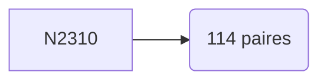

# Rapport de Recherche : Géométrie des Nombres Premiers
**Système :** Loi de Monfette & Cube-Orbit
**Cible :** N = 2310 | **Phase :** 150°
**Densité de Goldbach :** 0.049351

---

## 1. Rappel des Lois Fondamentales
*   **Loi p-e/p-k :** $Res(P_n \times p) = Res(P_n) \times (p - k)$
*   **Autoroutes :** Flux stabilisés sur les 8 rayons du groupe $\mathcal{R}_{30}$.

## 2. Analyse des Résultats
L'analyse visuelle confirme que pour N=2310, les tunnels de Goldbach (connexions $p+q$) sont strictement confinés aux autoroutes de résidus. Le cycle 360 assure la répétitivité de cette structure.

## 3. Données des Paires Admissibles (Top 20)

| Premier P | Premier Q | Résidu P | Résidu Q |
|-----------|-----------|----------|----------|
| 13 | 2297 | 13 | 17 |
| 17 | 2293 | 17 | 13 |
| 23 | 2287 | 23 | 7 |
| 29 | 2281 | 29 | 1 |
| 37 | 2273 | 7 | 23 |
| 41 | 2269 | 11 | 19 |
| 43 | 2267 | 13 | 17 |
| 59 | 2251 | 29 | 1 |
| 67 | 2243 | 7 | 23 |
| 71 | 2239 | 11 | 19 |
| 73 | 2237 | 13 | 17 |
| 89 | 2221 | 29 | 1 |
| 97 | 2213 | 7 | 23 |
| 103 | 2207 | 13 | 17 |
| 107 | 2203 | 17 | 13 |
| 131 | 2179 | 11 | 19 |
| 149 | 2161 | 29 | 1 |
| 157 | 2153 | 7 | 23 |
| 167 | 2143 | 17 | 13 |
| 173 | 2137 | 23 | 7 |

