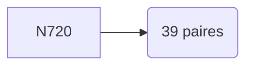

# Rapport de Recherche : Géométrie des Nombres Premiers
**Système :** Loi de Monfette & Cube-Orbit
**Cible :** N = 720 | **Phase :** 0°
**Densité de Goldbach :** 0.054167

---

## 1. Rappel des Lois Fondamentales
*   **Loi p-e/p-k :** $Res(P_n \times p) = Res(P_n) \times (p - k)$
*   **Autoroutes :** Flux stabilisés sur les 8 rayons du groupe $\mathcal{R}_{30}$.

## 2. Analyse des Résultats
L'analyse visuelle confirme que pour N=720, les tunnels de Goldbach (connexions $p+q$) sont strictement confinés aux autoroutes de résidus. Le cycle 360 assure la répétitivité de cette structure.

## 3. Données des Paires Admissibles (Top 20)

| Premier P | Premier Q | Résidu P | Résidu Q |
|-----------|-----------|----------|----------|
| 11 | 709 | 11 | 19 |
| 19 | 701 | 19 | 11 |
| 29 | 691 | 29 | 1 |
| 37 | 683 | 7 | 23 |
| 43 | 677 | 13 | 17 |
| 47 | 673 | 17 | 13 |
| 59 | 661 | 29 | 1 |
| 61 | 659 | 1 | 29 |
| 67 | 653 | 7 | 23 |
| 73 | 647 | 13 | 17 |
| 79 | 641 | 19 | 11 |
| 89 | 631 | 29 | 1 |
| 101 | 619 | 11 | 19 |
| 103 | 617 | 13 | 17 |
| 107 | 613 | 17 | 13 |
| 113 | 607 | 23 | 7 |
| 127 | 593 | 7 | 23 |
| 149 | 571 | 29 | 1 |
| 151 | 569 | 1 | 29 |
| 157 | 563 | 7 | 23 |

