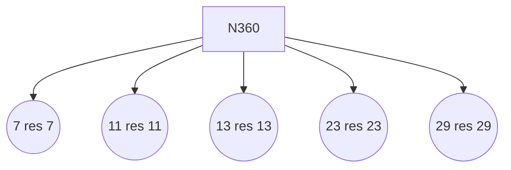

# Rapport d'Analyse : Système de Monfette & Cube-Orbit
**Date :** 21/04/2026 00:55
**Cible d'analyse :** N = 360 (Phase 0°)

---

## 1. Fondements Théoriques

### Loi p-e et p-k de Monfette
*   **Loi p-2 :** $Res(P_n \times p) = Res(P_n) \times (p - 2)$
*   **Loi p-k :** $Res(P_n \times p) = Res(P_n) \times (p - k)$

### Reformulation de la Conjecture de Goldbach
Pour tout entier pair $N \geq 4$, il existe une paire admissible $(a,b) \in \mathcal{R}_{30}^2$ et des entiers premiers $p,q$ tels que :
$$N = p + q, \quad p \equiv a \pmod{30}, \quad q \equiv b \pmod{30}$$

---

## 2. Analyse du Cycle 360
L'observation graphique montre une **invariance de phase** tous les 360 degrés. 
*   **Autoroutes :** Les trajectoires des 8 résidus $\{1, 7, 11, 13, 17, 19, 23, 29\}$ forment des filaments hélicoïdaux stables (Largeur 0.6).
*   **Tunnels :** Pour $N$ et $N+360$, les vecteurs de solutions s'alignent sur les mêmes coordonnées angulaires.

---
## 3. Données de Calcul (N=360)
Nombre de paires : 22

| P | Q | Res P | Res Q |
|---|---|---|---|
| 7 | 353 | 7 | 23 |
| 11 | 349 | 11 | 19 |
| 13 | 347 | 13 | 17 |
| 23 | 337 | 23 | 7 |
| 29 | 331 | 29 | 1 |
| 43 | 317 | 13 | 17 |
| 47 | 313 | 17 | 13 |
| 53 | 307 | 23 | 7 |
| 67 | 293 | 7 | 23 |
| 79 | 281 | 19 | 11 |
| 83 | 277 | 23 | 7 |
| 89 | 271 | 29 | 1 |
| 97 | 263 | 7 | 23 |
| 103 | 257 | 13 | 17 |
| 109 | 251 | 19 | 11 |
| 127 | 233 | 7 | 23 |
| 131 | 229 | 11 | 19 |
| 137 | 223 | 17 | 13 |
| 149 | 211 | 29 | 1 |
| 163 | 197 | 13 | 17 |

