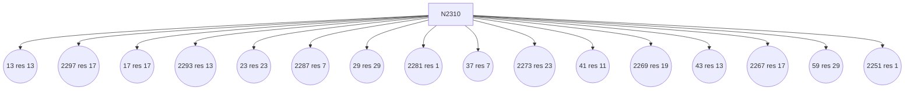

### Structure de Goldbach pour N=2310

```mermaid
graph TD
  N2310 --> P13((13 res 13))
  N2310 --> Q2297((2297 res 17))
  N2310 --> P17((17 res 17))
  N2310 --> Q2293((2293 res 13))
  N2310 --> P23((23 res 23))
  N2310 --> Q2287((2287 res 7))
  N2310 --> P29((29 res 29))
  N2310 --> Q2281((2281 res 1))
  N2310 --> P37((37 res 7))
  N2310 --> Q2273((2273 res 23))
  N2310 --> P41((41 res 11))
  N2310 --> Q2269((2269 res 19))
  N2310 --> P43((43 res 13))
  N2310 --> Q2267((2267 res 17))
  N2310 --> P59((59 res 29))
  N2310 --> Q2251((2251 res 1))
```